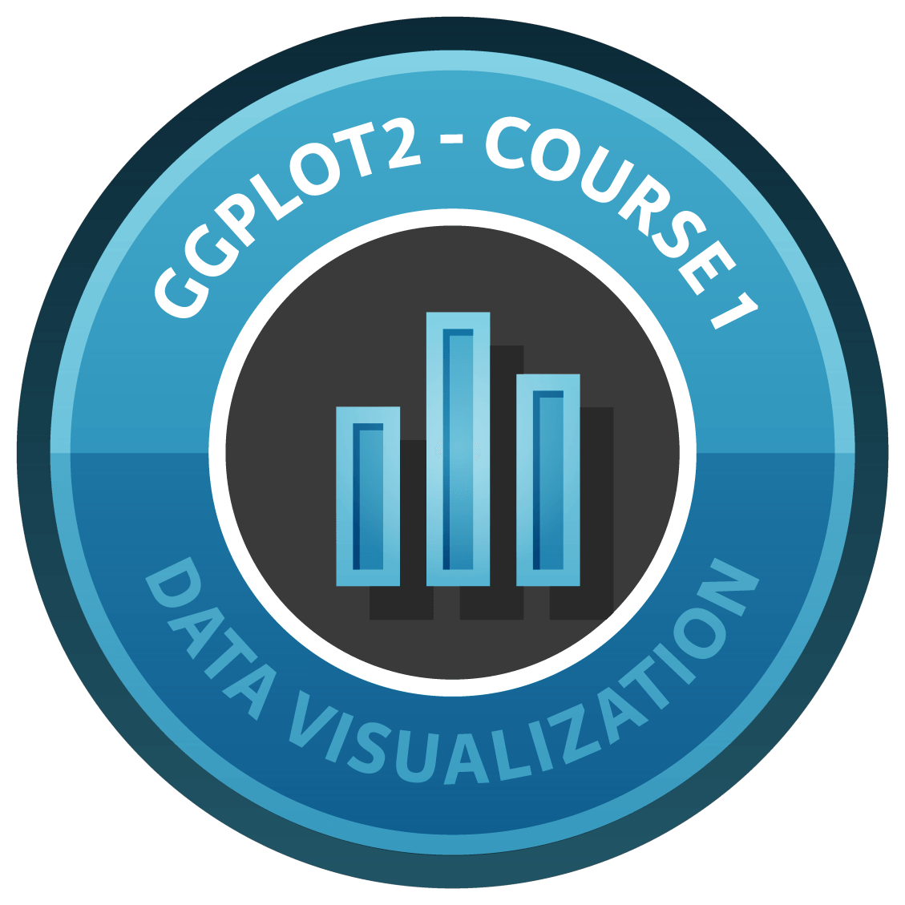

```{r setup, include=FALSE}
knitr::opts_chunk$set(show_col_types = FALSE)
```



# Tujuan Analisis

Sebagai seorang mahasiswa, tujuan saya dalam membuat visualisasi data menggunakan ggplot2 di RStudio adalah untuk menyederhanakan penyampaian informasi yang kompleks agar lebih mudah dipahami. Dengan memanfaatkan RMarkdown, saya dapat mengintegrasikan visualisasi ini dengan narasi yang mendukung, sehingga data yang disajikan tidak hanya informatif tetapi juga menarik secara visual. Visualisasi ini bertujuan untuk:

1. Mengungkap Pola dan Tren :
Membantu mengidentifikasi hubungan atau pola dalam data, seperti distribusi, perbandingan antar kategori, atau tren perubahan.

2. Mendukung Pengambilan Keputusan :
Menyediakan informasi yang berbasis data untuk mendukung kesimpulan atau rekomendasi dalam penelitian saya.

3. Meningkatkan Pemahaman Data:
Mengkomunikasikan hasil analisis secara efektif kepada audiens, baik itu dosen, teman sekelas, atau pembaca lainnya.

# RMARKDOWN

RMarkdown adalah format file yang digunakan di dalam ekosistem RStudio untuk membuat dokumen yang menggabungkan teks naratif, kode, dan hasil analisis (seperti grafik atau tabel) dalam satu file. File ini biasanya memiliki ekstensi .Rmd.

Fitur Utama RMarkdown
Mengintegrasikan Teks dan Kode: Anda dapat menulis teks biasa (dalam format Markdown) sambil menyisipkan kode R (atau bahasa pemrograman lainnya) yang dapat dijalankan langsung di dokumen.

Mendukung Berbagai Output: Anda bisa menghasilkan laporan dalam berbagai format seperti:

- HTML (untuk web)
- PDF (untuk cetak atau presentasi)
- Word (untuk dokumen formal)
- Presentasi (menggunakan slidify atau ioslides)
- Kode yang Reproducible: Semua kode di dalam dokumen dapat dieksekusi, dan hasilnya (grafik, tabel, atau analisis) akan muncul langsung di laporan. Ini mendukung reproducible research.

Fleksibilitas Format Markdown: Markdown adalah bahasa markup ringan yang mudah digunakan untuk membuat teks berformat seperti:

- Judul (# Title)
- Teks tebal (**bold**)
- Daftar (- List)

# Chunk

Kode didalam RStudio bekerja menggunakan konsep **chunk**. Chunk dapat berguna untuk membedakan antara kode dengan **plain text**. Satu chunk diawali dan diakhiri dengan ```. Sebelum menulis Anda harus menentukan bahasa kode apa yang akan ditulis didalam chunk. Berikut cara menentukan bahasa kode dan menamai chunk :
- {r nama_chunk} untuk kode R
- {python nama_chunk} untuk kode python
- {mermaid nama_chunk} untuk kode mermaid

Catatan : nama chunk tidak boleh mengandung spasi, gunakan "_".

# Library

Didalam RStudio Anda dapat membuat banyak hal dengan menggunakan berbagai library. Cara untuk menggunakan library adalah dengan mendownload library nya kemudian memanggil library yang sudah didownload didalam chunk. Anda tidak perlu memanggil library yang sama setiap kali ingin membuat sesuatu cukup dengan membuat satu chunk dan jadikan chunk ini chunk pertama, kemudian panggil semua library yang dibutuhkan. Dengan cara ini Anda dapat menggunakan library yang sama di seluruh dokumen Anda.

# GGPLOT2

**ggplot2** adalah salah satu paket (library) dalam R yang sangat populer untuk membuat visualisasi data. Paket ini menggunakan konsep Grammar of Graphics, di mana grafik dibangun dari lapisan-lapisan yang dapat dikombinasikan untuk menghasilkan visualisasi yang kompleks.Komponen Utama :
- ggplot2Data (data): Dataset yang digunakan untuk membuat grafik.
- Aesthetic Mappings (aes): Menentukan bagaimana data ditampilkan secara visual, seperti sumbu x, sumbu y, warna, ukuran, dll.
- Geometries (geom): Jenis grafik yang ingin ditampilkan, seperti titik (scatter plot), garis, bar, histogram, dll.
- Facets: Membagi grafik menjadi beberapa subgrafik berdasarkan kategori tertentu.Scales: Menyesuaikan tampilan, seperti skala warna, ukuran, atau sumbu.Themes:
- Mengontrol aspek visual seperti font, latar belakang, garis sumbu, dll.

Sintaks dasar ggplot2:
```
library(ggplot2)

ggplot(data, aes(x = x_var, y = y_var)) +
  geom_<type>(...) +
  theme_<style>(...)
```


Contoh sederhana
- Scatter Plot
```{r}
library(ggplot2)
data <- data.frame(x=rnorm(50),y=rnorm(50))

ggplot(data,aes(x=x,y=y))+geom_point(color="blue",size=3,shape=6)+labs(title="Contoh Scatter Plot",x="X-Axis",y="Y-Axis")+theme_minimal()
```

- Bar Chart
```{r}
library(ggplot2)

data <- data.frame(
  category=c("A","B","C","D"),
  value=c(10,7,5,4)
)
  
ggplot(data,aes(x=category,y=value,fill=category))+geom_bar(stat="identity")+labs(title="Contoh Bar Chart")+theme_classic()
```

- Histogram
```{r}
library(ggplot2)

data <- data.frame(value = rnorm(100))

ggplot(data, aes(x = value)) +
  geom_histogram(binwidth = 0.5, fill = "skyblue", color = "black") +
  labs(title = "Histogram Distribusi Normal", x = "Nilai", y = "Frekuensi") +
  theme_minimal()
```

- Line Plot
```{r}
library(ggplot2)

data <- data.frame(x = 1:10, y = cumsum(rnorm(10)))

ggplot(data, aes(x = x, y = y)) +
  geom_line(color = "red", size = 1) +
  geom_point(color = "blue", size = 3) +
  labs(title = "Contoh Line Plot", x = "X", y = "Y") +
  theme_minimal()

```

Keunggulan ggplot2
- Fleksibilitas Tinggi: Dapat digunakan untuk berbagai jenis grafik, mulai dari sederhana hingga kompleks.
- Customizable: Grafik dapat disesuaikan hingga ke detail terkecil.
- Integrasi Dataframe: Sangat cocok untuk analisis data yang berbasis dataframe.

# Cara Kerja GGPLOT2

**GGPLOT2** adalah paket dalam R yang memungkinkan pengguna untuk membuat visualisasi data yang sangat fleksibel dengan menggunakan Grammar of Graphics. Alur kerjanya dapat dibagi menjadi beberapa langkah untuk membangun visualisasi secara bertahap, mulai dari data hingga penyesuaian estetika dan tipe grafik.

Berikut adalah penjelasan alur penggunaan ggplot secara umum:

1. Persiapkan Dataset
Sebelum membuat grafik, Anda perlu memiliki data dalam format yang dapat dipahami oleh R, seperti sebuah data frame. Dataset ini bisa berisi berbagai kolom yang mewakili variabel atau atribut yang ingin divisualisasikan.

```
data <- data.frame(
  kategori = c("A", "B", "C", "D"),
  nilai = c(10, 20, 30, 40)
)
```

2. Membuat Objek ggplot dengan Dataset
Langkah pertama dalam membangun visualisasi adalah memanggil fungsi ggplot(), yang membutuhkan dataset dan peta estetika (mapping) dari data tersebut. Fungsi ini akan menjadi dasar untuk menambahkan elemen-elemen lain ke grafik.

Sintaks:
```
ggplot(data, aes(x = kategori, y = nilai))
```

- data: Dataset yang akan digunakan untuk plot.
- aes(): Fungsi yang digunakan untuk mendefinisikan peta estetika, yaitu cara data diterjemahkan ke dalam bentuk visual. Di dalam aes(), Anda menentukan variabel mana yang akan dipetakan ke sumbu x, sumbu y, warna, ukuran, dll

3. Menambahkan Geometri (Geoms)
Setelah memulai plot dengan ggplot(), Anda akan menambahkan elemen grafis yang disebut geometries (atau geoms). Geom ini menentukan bentuk visualisasi yang ingin Anda buat, seperti titik, garis, batang, dan sebagainya.

Contoh:
- geom_bar(): Untuk membuat bar chart (diagram batang).
- geom_point(): Untuk membuat scatter plot (grafik titik).
- geom_line(): Untuk membuat line plot (grafik garis)

Sintaks:
```
ggplot(data, aes(x = kategori, y = nilai)) + geom_bar(stat = "identity")
```

4. Menambahkan Label dengan labs()
Fungsi labs() digunakan untuk menambahkan elemen teks ke grafik, seperti judul grafik, label sumbu, dan legenda.

Sintaks:
```
ggplot(data, aes(x = kategori, y = nilai)) +
  geom_bar(stat = "identity") +
  labs(title = "Grafik Nilai per Kategori", x = "Kategori", y = "Nilai")
title: Menambahkan judul pada grafik.
x: Menambahkan label pada sumbu x.
y: Menambahkan label pada sumbu y.
```

5. Menambahkan Penyesuaian Visual dengan theme()
Fungsi theme() digunakan untuk menyesuaikan elemen-elemen visual dari plot, seperti font, warna latar belakang, grid, dll. Ini memungkinkan Anda untuk memberikan gaya atau penampilan khusus pada grafik.

Sintaks:
```
ggplot(data, aes(x = kategori, y = nilai)) +
  geom_bar(stat = "identity") +
  labs(title = "Grafik Nilai per Kategori", x = "Kategori", y = "Nilai") +
  theme_minimal()
theme_minimal(): Menggunakan tema minimalis yang menghilangkan garis grid dan latar belakang berwarna.
```

6. Menambahkan Skala (Opsional)
Anda juga bisa menyesuaikan skala untuk variabel tertentu. Misalnya, Anda bisa mengubah warna menggunakan scale atau menyesuaikan ukuran titik dengan scale_size().

Contoh menambahkan skala warna:
```
ggplot(data, aes(x = kategori, y = nilai, fill = kategori)) +
  geom_bar(stat = "identity") +
  scale_fill_manual(values = c("red", "blue", "green", "purple")) +
  labs(title = "Grafik Nilai per Kategori", x = "Kategori", y = "Nilai")
```

# Alur Umum Penggunaan ggplot2

- Siapkan Dataset: Dataset yang berisi data yang ingin dianalisis.
- Fungsi ggplot(): Membuat objek dasar plot yang menggunakan dataset dan menetapkan peta estetika.
- Tambahkan Geom: Pilih dan tambahkan jenis plot (scatter, line, bar, dll) yang sesuai dengan tujuan visualisasi.
- Penyesuaian: Gunakan labs() untuk menambahkan label dan theme() untuk menyesuaikan tampilan.
- Opsional: Tambahkan skala dan elemen lain sesuai kebutuhan.

Contoh Lengkap:
```
data <- data.frame(
  kategori = c("A", "B", "C", "D"),
  nilai = c(10, 20, 30, 40)
)

ggplot(data, aes(x = kategori, y = nilai, fill = kategori)) +
  geom_bar(stat = "identity") +
  labs(title = "Grafik Nilai per Kategori", x = "Kategori", y = "Nilai") +
  theme_minimal()
```

**ggplot2** memungkinkan Anda membuat grafik secara bertahap dengan menambahkan elemen satu per satu: dimulai dengan data, kemudian peta estetika (aes()), diikuti dengan jenis grafik (geom_*), dan akhirnya menyesuaikan tampilan dengan labs() dan theme().

# Membuat Grafik Dengan GGPLOT2

Untuk membuat grafik dengan GGPLOT2, Anda dapat memanggil semua library yang dibutuhkan dan membuat dataset didalam satu chunk dan gunakan chunk lain untuk membuat grafik Anda seperti ini :
```{r library_chunk}
library(ggplot2)
library(gganimate)
library(gifski)
library(readr)
library(readxl)
library(plotly)
library(htmltools)
library(htmlwidgets)

Datavis <- read_excel("Datavis.xlsx")
```

Setelah Anda memanggil semua library yang dibutuhkan, Anda dapat memulai membuat grafik.

## Grafik Univariat

```{r Grafik_Univariat}
# membuat Plot sederhana dan mengubah backgroundnya dengan plot.background dan panel.background
ggplot(Datavis,aes(x=Angka_Harapan_Hidup))+geom_histogram(binwidth=3,fill="steelblue",color="white",alpha=0.8)+labs(title="Sebaran Angka Harapan Hidup",x="Angka Harapan Hidup",y="Angka")+theme(
  plot.background = element_rect(fill="white"),
  panel.background = element_rect(fill="black")
)
```

## Grafik Bivariat (Scatter Plot)

```{r grafik_bivariat}
# Membuat plot dengan variable x dan y
ggplot(Datavis,aes(x=Angka_Harapan_Hidup,y=Pendapatan_per_kapita))+geom_point(aes(color=Benua),size=1.5,alpha=0.7)+labs(title="Pendapatan Per Kapita vs Angka Harapan Hidup",x="Angka Harapan Hidup",y="Pendapatan Per Kapita")+theme(
  plot.background = element_rect(fill="white"),
  panel.background = element_rect(fill="black")
)
```

## Grafik Multivariat

- Scatter Plot : Warna & Ukuran
```{r grafik_multivariat:color&size}
# Membuat plot dan menambahkan warna dan ukuran yang berbeda setiap kategori dengan parameter color & size
ggplot(Datavis,aes(x=Pendapatan_per_kapita,y=Angka_Harapan_Hidup))+geom_point(aes(color=Benua,size=Populasi))+labs(title="Pendapatan Per Kapita vs Angka Harapan Hidup",x="Pendapatan Per Kapita",y="Angka Harapan Hidup",color="Benua",size="Populasi")+theme(
  plot.background = element_rect(fill="white"),
  panel.background = element_rect(fill="#222831")
)
```
- Scatter Plot : Faceted
```{r grafik_multivariat:faceted}
# Membuat Plot dan memisahkan Benua menggunakan facet_wrap()
ggplot(Datavis,aes(x=Pendapatan_per_kapita,y=Angka_Harapan_Hidup))+geom_point(aes(color=Benua,size=Jumlah_anak-1),alpha=0.7)+facet_wrap(~Benua)+labs(title="Pendapatan Per Kapita vs Angka Harapan Hidup",x="Pendapatan Per Kapita",y="Angka Harapan Hidup",color="Warna",size="Populasi")+theme(
  plot.background = element_rect(fill="white"),
  panel.background = element_rect(fill="#222831")
)
```
- Scatter Plot : Faceted (Animated)
```{r grafik_multivariat:faceted_(animated)}
# Membuat Plot
plot <- ggplot(Datavis,aes(x=Pendapatan_per_kapita,y=Angka_Harapan_Hidup))+geom_point(aes(color=Benua,size=Jumlah_anak-1),alpha=0.7)+facet_wrap(~Benua)+labs(title="Pendapatan Per Kapita vs Angka Harapan Hidup",x="Pendapatan Per Kapita",y="Angka Harapan Hidup",color="Warna",size="Populasi")+theme(
  plot.background = element_rect(fill="white"),
  panel.background = element_rect(fill="#222831")
)

# Menambahkan parameter tranisition kedalam plot
animated_plot <- plot+transition_time(Tahun)+ease_aes("linear")+labs(subtitle = paste("Tahun : {scales::label_number()(frame_time)}"))

# Merender dan menyimpan plot animasi ke dalam format .gif dengan gifski
animate(animated_plot,nframes=150,renderer=gifski_renderer("animated_scatter_plot_faceted.gif"))
```

## Grafik Interaktif

- Bubble Plot : Interaktif (Plotly)
```{r}
# Membuat Plot
plot <- plot_ly(Datavis, x = ~Pendapatan_per_kapita, y = ~Angka_Harapan_Hidup, z = ~Populasi, type = "scatter3d", mode = "markers", size = 1,color=~Benua) %>%
  layout(title = "3D Scatter Plot",
         scene = list(xaxis = list(title = "Pendapatan per Kapita"),
                      yaxis = list(title = "Angka Harapan Hidup"),
                      zaxis = list(title = "Populasi")))

# Menampilkan plot
print(plot)
plot_browsable <- browsable(plot)
plot_browsable

# Menggunakan widget html
htmlwidgets::saveWidget(as_widget(plot), "3d_scatter_plot.html")
```

# Kesimpulan

Kemudahan Penggunaan:

**ggplot2** dan **plotly** adalah paket R yang sangat berguna untuk membuat grafik yang indah dan informatif. ggplot2 menggunakan pendekatan grammar of graphics yang memungkinkan pembuatan grafik secara bertahap melalui penambahan elemen-elemen grafis.

Dengan plotly, Anda dapat mengambil grafik statis dari ggplot2 dan menambahkannya ke dalam grafik interaktif yang dapat diakses secara web.

- Fleksibilitas dan Kustomisasi:

Keduanya menawarkan fleksibilitas tinggi dalam mengkustomisasi elemen grafis seperti warna, ukuran, bentuk, dan label. Adanya fungsi tema dalam ggplot2 memungkinkan penyesuaian tampilan grafik secara keseluruhan, sementara plotly memungkinkan penambahan interaktivitas seperti tooltips dan animasi.

ggplot2 memungkinkan pembuatan grafik yang bersih dan profesional untuk publikasi, sedangkan plotly menambahkan dimensi interaktivitas yang cocok untuk presentasi web-interaktif.

- Visualisasi 3D dan Animasi:

plotly memungkinkan pembuatan grafik **3D** seperti plot scatter 3D dan surface plot, serta menambahkan animasi untuk menunjukkan perubahan data seiring waktu.

- Generalisasi dan Penggunaan Lebar:

ggplot2 digunakan secara luas oleh akademisi, analis data, dan ilmuwan data untuk pembuatan grafik berkualitas tinggi. plotly sering digunakan untuk membuat presentasi data lebih menarik dan dinamis, dengan kemampuan untuk berinteraksi dengan grafik secara langsung di browser.

Dengan memanfaatkan kekuatan kedua alat ini, Anda bisa menghasilkan visualisasi data yang tidak hanya menarik tetapi juga penuh informasi dan mudah disesuaikan sesuai kebutuhan. Mereka memperkuat kemampuan Anda dalam menyampaikan cerita data dengan cara yang lebih efektif dan menarik.